# EN.525.615 Laboratory 01
## Dr. David Jansing

## Experiment 1:  Set Up

### Development Environment Setup

Please see the Development Environment Setup guides for your particular OS.  Currently, there are guides for Windows and Mac.  While GNU/Linux is supported and recommended, there isn't a guide at this time.  Let's be honest; if you are running Linux, chances are very good that your sharp enough to install the Dev Environment without a lot of guidance.  However, in the event you do get stuck, reach out to the instructor.  That goes for the Mac/Windows setups as well.  The instructor is currently using Mac.

[Windows Dev Env Setup](dev_environment_win.adoc)  
[Mac Dev Env Setup](dev_environment_mac.adoc)

### Git and GitHub Setup

This course will make extensive use of Git and GitHub.  If you already have a GitHub account setup where you can clone private repositories, then you are welcome to skip this section and use that account.

#### Create A GitHub Account

[Sign up](https://github.com/join) for a GitHub account.

#### Git Identity

Everytime you pull or push to your repository, Git needs to know your identity.  Open a terminal and enter the following commands, substituting in your name and email address.

```
git config --global user.name "First Lastname"
git config --global user.email my_fancy_email_addy@email_service.com
```

Note, if you use Git at work and have other Git services (like GitLab), changing this may affect how you access those repos.  Managing this is a little tricky and the instructor offers no specific advice, but that of caution.

#### Authentication

There are currently two ways to authenticate in GitHub:  Two-Factor Authentication (TFA) and SSH Keys.  The student should select the authentication method that best suits their needs and computing environment (for example, some company laptops will not allow SSH connections, making TFA the only option available).

The instructions for TFA can be found in [this](https://docs.github.com/en/authentication/securing-your-account-with-two-factor-authentication-2fa) set of documents.

The instructions for SSH can be found in [this](https://docs.github.com/en/authentication/connecting-to-github-with-ssh) set of documents.

#### Using Repositories

Some folks prefer using the command line version of Git.  Some folks would rather using a development environment or desktop tool.  GitHub has a [desktop app available](https://desktop.github.com/) for easier management of your repo.  You have your choice of how you want to interface with your repo.  You are *required* to use a repo for each laboratory.  You are also *required* to use GitHub Issues to outline your workflow.  Creating issues, tracking issues, and then closing them helps the instructor to understand where in the process a given student is, particularly if the student needs help with something.
 
### GitHub Classroom

Once you have full access to GitHub and can create or clone repositories, pull and push commits in code, then you are ready to start working in GitHub Classroom.  Classroom is a service provided by GitHub that allows an instructor to set up a common template and private repositories for educational purposes.  At the start of each lab, you will click on the GitHub Classroom link, go to the website, you should see your name in the student list.  Claim your name and repo.  By doing this, you are *accepting* the assignment.

### Clone The Repository

After you have claimed your repo for that assignment, you will clone it to your local machine for working the assignment.  Again, you are welcome to use the desktop app to do this.  You are also welcome to do it via the command line.

First, find a place on your local machine where you are going to work.  You only have to do this one time.  Create a directory called `en525-615`.  This directory is where you will put each of your classroom repos for each assignment.  Note, you should not do this on Dropbox or Box folders, as those cloud services don't know how to handle git repositories.  Keep the repos and your work on your local machine.  The backup *is* the GitHub repo.  Of course, this means that you need to commit your code often.

Once you have created `en525-615`, clone the first GitHub Classroom repo there.  For those using the command line, your command will likely look like: `$ git clone <link_to_repository>`, where `<link_to_repository>` is either an HTTPS link or an SSH link, depending on which authetication method you chose.  The desktop app has a `Clone Repository` menu option (for the Mac version, it's under `File`).

### GitHub Issues

As a part of your workflow, you are required to use GitHub issues in all labs.  You should look over the laboratory and each of the experiments in the laboratory and create an issue for each major task.  You should also create an issue when you are working on your code and you find a bug that you have to squash, particularly if you have to stop working for some reason and have to pick it up later.  These issues will help the instructor understand where you are in the process and how they might be able to provide assistance.

In the GitHub website, you will see a tab at the top of a project called `Issues`.  You can create a new issue by pressing on the green button `New issue`.  This will allow you to create a new issue, assign it to someone (typically yourself, since you are working individually and not on teams), and perhaps assign a due date.  Comments can be attached to each issue and this gives a history of what has been done to address that issue, particularly if the issue is a problem/bug that needs to be corrected.

Using the first laboratory project repository, create the following issues:

- Set up development environment
- Create Issue Examples
- Complete Hello World Tutorial

Create any other issues you find important as you read through the rest of this laboratory.

## Experiment 2:  Hello World

In this section, you will create and run a very simple "Hello World" application.  You will use a native GCC toolchain within the STM32CubeIDE application and run/debug the application on your local machine (most likely an x86_64 computer, although other architectures might be possible, depending on your local machine).

* Launch **STM32CubeIDE**
* The following directory structure is required for this course:

```
<root>
 └───jhu
      └───en525-615
           ├───lab1
           │    ├───report
           │    |    └───media
           |    ├───supporting
           │    └───workspace  <<= Workplace Used by STMCubeIDE/Eclipse for Lab 1
           ├───lab2
           │    ├───report
           |    ├───supporting
           │    └───workspace  <<= Workplace Used by STMCubeIDE/Eclipse for Lab 2
          ~~~
           └───lab12
```

The `report` directory is where your lab report will go.  Inside the `report` directory is the `media` directory where image files and other media will be placed.  **Do not place videos in your repository.  They are too big for git and will possibly create significant issues that might be difficult to resolve.  Videos should go on either Microsoft Teams or on a private YouTube channel.**  The `supporting` directory is for miscellaneous files that aren't directly connected to either the lab report or the STM32 code.  Finally, the `workspace` directory is what you will use for your STM32 development work.

* When prompted, select the `workspace` folder for the STM32CubeIDE workspace.

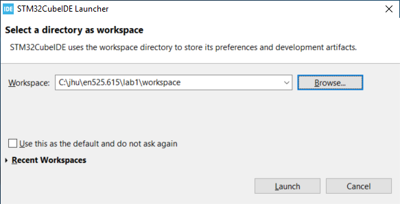

Once you've selected the workspace, an empty workspace will be presented.

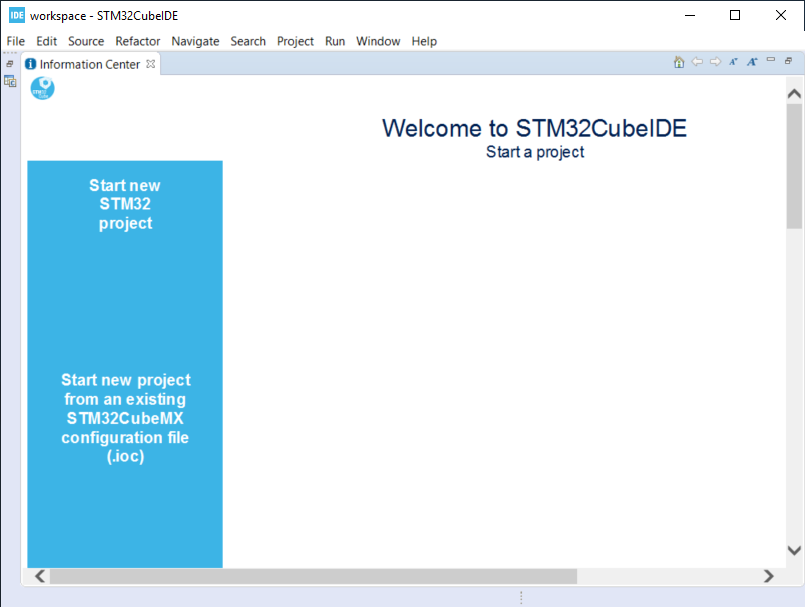

### Create a C\C++ Project

* Select `File`->``New``->``C/C++ Project``
* Select `C Managed Build` and Click `Next`

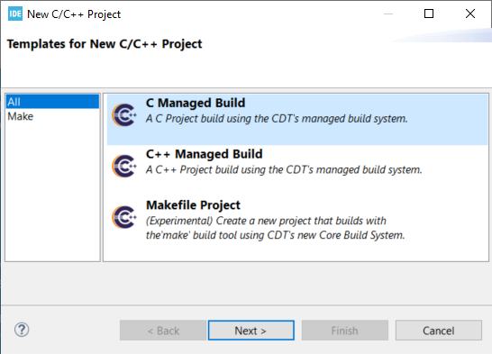

* For `Project Name:` enter `Hello_world_Tutorial`
* For `Project type:` select `Hellow World ANSI C Project`
* For `Toolchains:` select `MingGW GCC`, or `MacOSX GCC` if on a Mac
* Click `Next`

These steps may vary somewhat depending on the platform you're using (Windows vs Mac vs Linux).

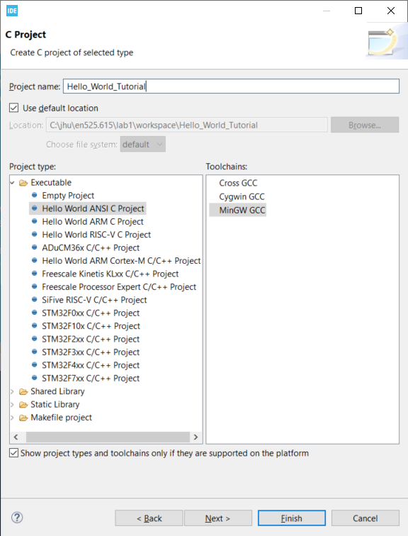

* Enter your Name in the `Author` Box
* Click `Finish`

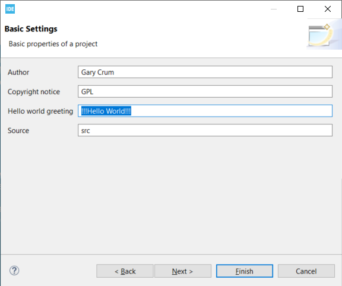

* Cick the 'X' on the Information Center Tab to view the project workspace

You should now see a workspace similar to the image below.

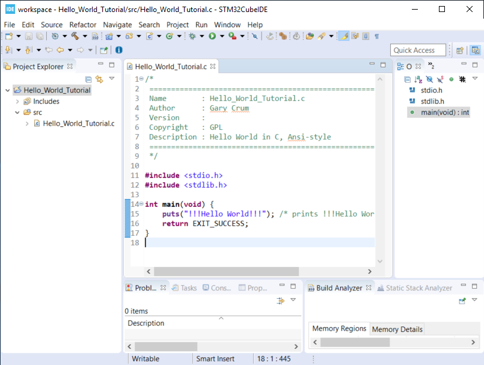

### Build the Project

* Under the Project Explorer Tab
* Right Click `Hello_World_Tutorial`
* Click `Build Project`

In the CDT Build Console you will see the compiler build log with 0 error and 0 warnings.

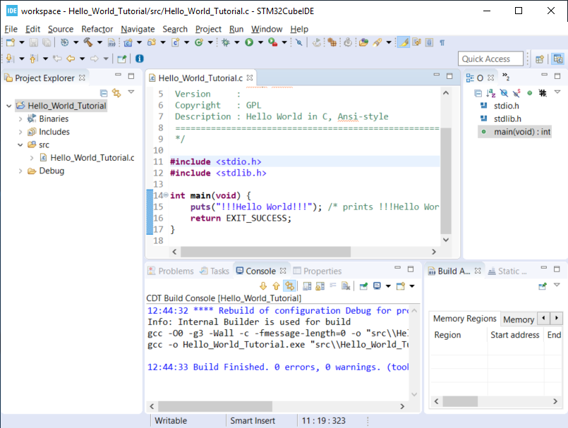

### Create a Run\Debug Configuration for the Project

* With `Hello_World_Tutorial` selected in the `Project Explorer` tab
* Select ``Run``->``Debug Configurations...``

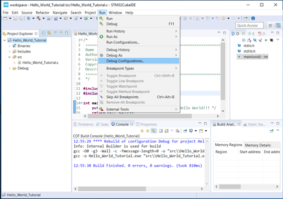

* The `Debug Configurations` Dialog Box should appear
* Double Click on `C/C++ Application`

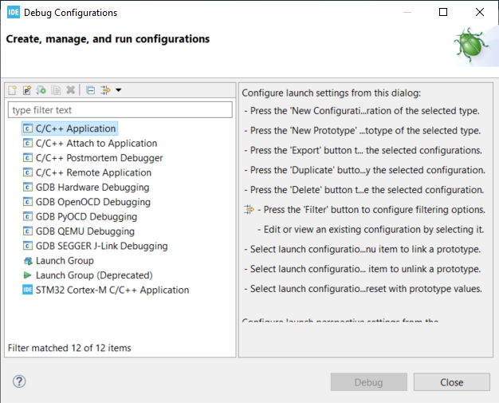

If you launched the dialog with the correct project selected the `Project` and `C/C++ Application` fields.
You can also fill it in manually or change it by clicking the `Browse...` button.

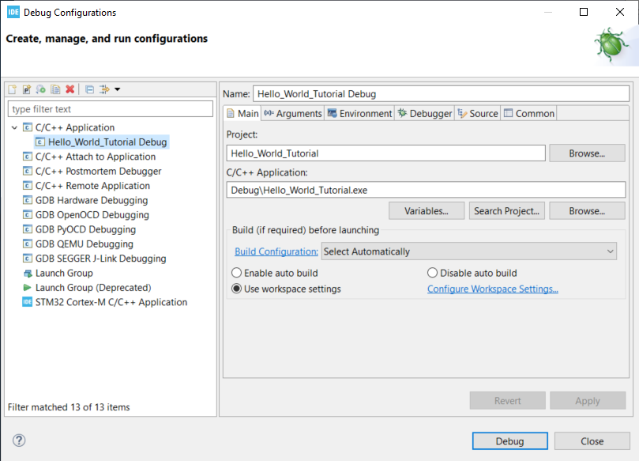

* Click the `Debugger` Tab and verify a few setting:
  - `Stop on start at:` is checked and `main` is in the entry
  - `GDB Debugger:` has `gdb` entered
  - Click `Debug`

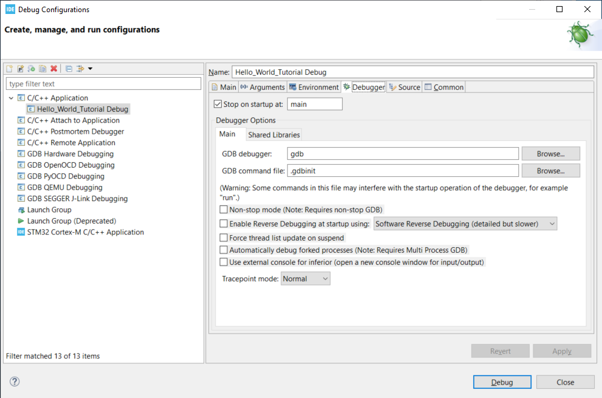

* You will be asked to switch to the `Debug perspective`
* Click `Switch`

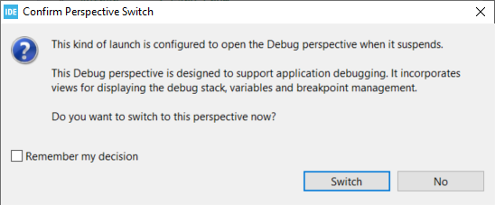

Your application should now be running and paused at the first executable line of the program.

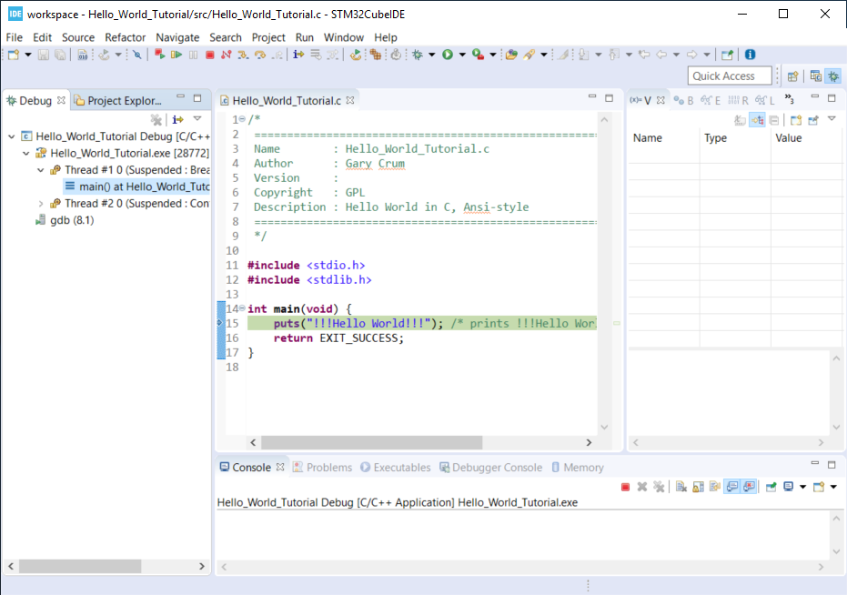

* Press `F8` or the `Resume` Button to resume the program.

No lab report is required for this laboratory.  Make sure your repository is up-to-date and fully committed before the due date.
